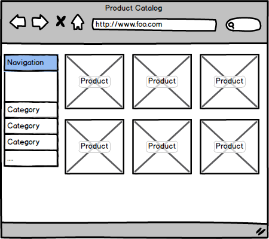
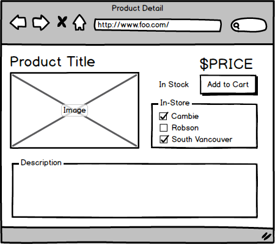

#Distributed Demo

The general gist of this demo…we have a commerce-y website. Displays the product listings and product details (price, description, etc.)
In addition to this basic information, we also surface information regarding the avaiability of the product - whether the product is currently
"In Stock" as well as whether the product is availabile in local ("bricks-and-mortar") stores.

The data driving the site is provided by a sort of [API Gateway](http://microservices.io/patterns/apigateway.html). Some of the data (the product 
catalog) is sourced from the gateway's own "database" directly. Information pertaining to availability is obtained via API calls to other services.

The availability information is really just a "nice-to-have" bit of functionality. Users still need to be able to browse the product listings and (though
it's not implemneted) presumeably be able to place orders, etc. 

##Scenario: View Product Catalog

This scenario is fairly uninteresting - _all_ the data presented here is sourced directly from the API Gateway. We *do*, however, want this feature to 
be as available as possible.

##Scenario: View Product Detail

This is where the availability ("In Stock", "In-Store") information is presented. Again, this data is obtained via API call to other services. As with the Product 
Catalog scenario - we want the user to be able to view product info (and Add-To-Cart), *even if* we aren't able to obtain current availability information.

##Hystrix

//ToDo

##Getting Started

//ToDo
